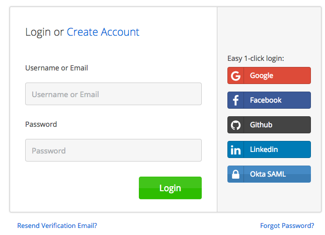

# Social Provider Integrations v2

## Feature Description

The framework integration should provide convenience support for the Social
Login providers that the Stormpath API supports.  At the time of writing we
support:

* Facebook
* GitHub
* Google
* LinkedIn

Coming Soon:

* Twitter
* Generic OAuth

## Background: Social Login Workflows

Social providers typically implement two authentication workflows: [page-based redirect](#page-based) workflow and [ajax-based](#ajax-based) worflow.

The framework integration interacts with Stormpath via the Stormpath Client API in a uniform way - regardless of the social provider.

The Stormpath Client API interacts with the Stormpath REST API which in turn, interacts directly with the social provider using its page-based redirect workflow.

All of these details are hidden from the framework integration. The framework integration can implement an ajax-based workflow or a page-based workflow as it sees fit.

There are two primary responsibilties of the framework integration:

1. Obtain a URL to interact with the Client API
2. Validate and parse a Stormpath JWT assertion response

## Obtain a URL to interact with the Client API

The Social Provider login flow starts with a call to the `/authorize` endpoint of the Client API. There are two ways to obtain the proper URL:

1. Get the URL directly from the Client API's `/login` model
    * recommended as the easiest way to get the fully qualified URL to start the social login flow
2. Construct the URL and add it to the framework integration's `/login` model.
    * useful if the framework integration has extended the `/login` model beyond the framework specification or uses any custom form fields

### Obtain the `/authorize` URL via the Client API `/login` model

In order to interact with the Client API, you need the `webConfig` from the backend `/application` endpoint:

`GET /applications/:applicationId?expand=webConfig`

This returns a response like:

```
{
    ...
    "webConfig": {
        ...
        "dnsLabel": "elegant-lynx",
        "domainName": "elegant-lynx.apps.dev.stormpath.io",
        ...
        "login": {
            "enabled": true
        },
        ...
        "status": "ENABLED",
        ...
    }
    ...
}
```

Once you have the `webConfig.domainName`, you can get the `/login` model from the Client API: `https://elegant-lynx.apps.dev.stormpath.io/login`.

The response from the Client API will look like this:

```
{
   "form":{
      ...
   },
   "accountStores":[
      {
         "authorizeUri":"https://<webConfig domain name>/authorize?response_type=stormpath_token&account_store_href=<url encoded linkedin dir href>",
         "name":"LinkedIn",
         "provider":{
            "href":"<linkedin dir href>/provider",
            "providerId":"linkedin",
            "clientId":"<client id>",
            "scope":"r_basicprofile r_emailaddress"
         },
         "href":"<linkedin dir href>"
      },
      {
         "authorizeUri":"https://<webConfig domain name>/authorize?response_type=stormpath_token&account_store_href=<url encoded facebook fir href>",
         "name":"Facebook Dir",
         "provider":{
            "href":"<facebook dir href>/provider",
            "providerId":"facebook",
            "clientId":"<client id>",
            "scope":"public_profile email"
         },
         "href":"<facebook dir href>"
      }
   ]
}
```

The available `/authorize` URL(s) can be used as-is to kick of the social login flow. There are additional parameters that can be added to the `/authorize` URL as described [here](#optional-query-parameters).

### Construct the `/authorize` URL

This part of the flow will constuct a valid `/authorize` URL for the Client API. This will be included in the [`/login` model](login.md) when a supported Stormpath Social Provider Directory is mapped to the application. Or, the link to `/authorize` will be followed when the social provider button is clicked on in HTML login form.

Below is an example of the expected login model response from the `/login` endpoint of the framework integration when LinkedIn and Facebook social providers are mapped to the application.

```
{
   "form":{
      ...
   },
   "accountStores":[
      {
         "authorizeUri":"https://<webConfig domain name>/authorize?response_type=stormpath_token&account_store_href=<url encoded linkedin dir href>",
         "name":"LinkedIn",
         "provider":{
            "href":"<linkedin dir href>/provider",
            "providerId":"linkedin",
            "clientId":"<client id>",
            "scope":"r_basicprofile r_emailaddress"
         },
         "href":"<linkedin dir href>"
      },
      {
         "authorizeUri":"https://<webConfig domain name>/authorize?response_type=stormpath_token&account_store_href=<url encoded facebook fir href>",
         "name":"Facebook Dir",
         "provider":{
            "href":"<facebook dir href>/provider",
            "providerId":"facebook",
            "clientId":"<client id>",
            "scope":"public_profile email"
         },
         "href":"<facebook dir href>"
      }
   ]
}
```

#### Hints for framework integrations in constructing `/authorize` URLs:

In order to determine the webConfig domain, the framework integration must expand the `webConfig` property of the Stormpath Application.

As a Stormpath REST API call, it looks like this:

`GET /applications/:applicationId?expand=webConfig`

The response looks like this:

```
{
    ...
    "webConfig": {
        ...
        "dnsLabel": "elegant-lynx",
        "domainName": "elegant-lynx.apps.dev.stormpath.io",
        ...
        "login": {
            "enabled": true
        },
        ...
        "status": "ENABLED",
        ...
    }
    ...
}
```

The conditions necessary to include the `authorizeUri` provider URL in the framework integration's `accountStores` login model are:

* A Social Provider Directory must be mapped to the Application
* webConfig.status = ENABLED
* webConfig.login.enabled = true

### Optional Query Parameters

#### `redirect_uri`

The `redirect_uri` query parameter indicates the "last leg" of the flow. It should be a fully qualified url and it *must* be in the list of `authorizedCallbackUris` from the `/applications/:appID` endpoint.

If this query parameter is not included on the `/authorize` URL, then the first element of the `authorizedCallbackUris` list will be used.

#### `scope`

A default `scope` for an individual social provider is automatically set on the backend. This can be overridden by providing the `scope` query parameter.

#### `state`

If the `state` parameter is included, it will be passed back in the final leg of the flow to your application via the `redirect_uri`.

This parameter can be user like a CSRF token. That is, during `/authorize` URL construction, you can save the `state` value and then compare it to the `state` value that's passed back in the final leg of the flow.

## `redirect_uri` response

The last leg of the social interaction is to send a `302` redirect to the browser. The `Location` will be the `redirect_uri` originally set in the `/authorize` URL at the beginning of the flow. It will include a `jwtResponse` query parameter as well as a `state` query parameter (if it was included at the beginning of the flow).

The JWT set as the `jwtResponse` has an `stt` header parameter of `assertion`.

### Verifying the `jwtResponse` JWT

The JWT in the `jwtResponse` is signed by the Client API. As such, the same signing key must be used to verify the JWT.

The Client API signing key can be retrieved by using the Stormpath API endpoint specified in the `signingApiKey` of the Application's `webConfig`:

```
"webConfig": {
	...
    "signingApiKey": {
        "href": "https://<Stormpath API Host>/v1/apiKeys/<API Key ID>"
    },
    "status": "ENABLED",
	...
}
```

Retrieving this URL returns an api key response that includes the API Key Secret used to sign the `jwtResponse`:

```
{
    "account": {
        "href": "<account href>"
    },
    "description": "<description>",
    "href": "<apiKeys href>",
    "id": "<API Key ID>",
    "name": "<name>",
    "secret": "<API Key Secret>",
    "status": "ENABLED",
    "tenant": {
        "href": "<tenant href>"
    }
}
```

Once verified, the `jwtResponse` should be processed in the usual way by the framework integration for an AUTHENTICATED response as indicated [here](/login.md#-post-response-handling).

## Look and Feel

All of the integrations, regardless of language, should have a consistent look and feel for the rendered buttons for social providers.

**Recommendation:**

The [Social Buttons for Bootstrap](https://lipis.github.io/bootstrap-social/) has a very clean consistent look and feel and has been adopted into the Java SDK. Cons for this approach are a dependency on Bootstrap.



**Pros:** Consistent, clean look and feel across all of Stormpath's integrations.

**Cons:** Depends on Bootstrap

<a name="page-based"></a>
### Page-based Redirect Workflow

In this situation, the user leaves your login page by redirect and is taken to
the provider for authentication.  Once authentication is complete, the user is
redirected back to a "callback" URI on your website.  This callback will provide
an access token or access code as a query parameter.  Your server uses a
confidential keypair of the provider to validate the token/code, then retrieves
the account data of the authenticated user.

<a name="ajax-based"></a>
### AJAX-based Workflow

In this situation the user does not leave your login page.  Instead a popup
window is created, and the user authenticates with the provider in that window.
The popup window is created by a JavaScript API in the browser, and when the
user is done with the popup window (either by authenticating or rejecting the
prompt) the JavaScript API will call back to your JavaScript application.  If
the user has authenticated you will be provided with a token/code, which you
must send to your server and validate with your confidential provider
credentials.  At this point the workflow is identical to the page-base redirect
workflow.

<a href="#top">Back to Top</a>

[login]: login.md
[registration]: registration.md
